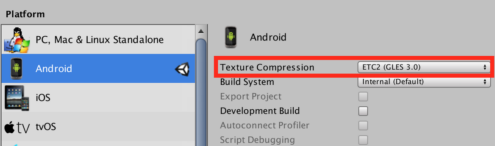

# Virtual Reality - Cardboard  (OSVR and Unity)

For this course we use [Unity 3D](https://unity3d.com/) 5.6.3f1 and [OSVR](https://github.com/OSVR/OSVR-Unity) as VR framework. OSVR is able to run on any Android device provided of a gyroscope and accelerometer. To check if your Android device is compatible, download the [Cardboard App](https://play.google.com/store/apps/details?id=com.google.samples.apps.cardboarddemo&hl=es_419). The following are the components required for the course.

### 1. Reticle VR

FOTO

The Reticle VR or Gaze VR is useful to interact with GameObjects, as follows:
- Rotate GameObjects
- Change Color of GameObjects
- Destroy GameObjects
- Drag and Drop 2D/3D GameObjects
- Add Force to GameObjects (Normal Vector)
- Impact Effect (Explosion Particles)

### 2. Movement in VR
For Virtual Reality in this course we focused in First Person Character Controller as movement for the most of the projects. This movement is able to manage with a Bluetooth Controller as is explained below. As well is possible to map the follwing movements:
- Third Person Character Controller
- Aircraft/Drone Controller
- Motorcycle Controller
- Car Controller

### 3. Software Patterns 
Utilizar de manera adecuada los scripts VR Interactive Item y VR Eye Raycaster de la OSVR que estamos utilizando:

Agregar el script VR Eye Raycaster a un sólo GameObject. Por ejemplo, agregarlo al GO de la cámara u ojos
Agregar el script VR Interactive Item a cada objeto para utilizar. Implementar las interacciones VR en este script

### 4. Class Diagram

Elaborar un diagrama de clases . Es muy parecido al que están elaborando para la Retícula VR

### 5. Build and Run
5.1. Generate an Android app of the developed project in Unity. 
5.2. Run the app in an Android device. 

In order to enhance the performance of the App, setup the Texture Compression in the Build Settings, as is shown in the following image:

  

### 6. Interactive Experience
For the final project is relevant includ the concepts of Game Design, such as: goal of the game, score, rules, awards, vivid interactive narrative and convinving mechanics.

Moreover, is important to enrich the experience with:

- Non Player Characters (NPC) from [Mixamo](https://www.mixamo.com)
- Waypoints para el caso de mover animales o automóviles
- Textures
- Physics simulation
- Explosion simulation
- Sound Effects 

### 7.  VR Glasses/Headset and Game Input for the Remote Controller 
For this course is highly recommended to get some budget VR Glasses and a Bluetooth Remote Control compatible with Android devices. A device recomended is the VR-PARK Portable Wireless Bluetooth 3.0 Remote Controller and a plastic headset, for instance, the budget VR Box.

In order to map the buttons of the controller with an Unity app running an Android device please check the following information:

- [KeyCode](https://docs.unity3d.com/ScriptReference/KeyCode.html)
- [Conventional Game Input](https://docs.unity3d.com/Manual/ConventionalGameInput.html)
- [Input.GetKey](https://docs.unity3d.com/ScriptReference/Input.GetKey.html)
- [Input.GetKeyDown](https://docs.unity3d.com/ScriptReference/Input.GetKeyDown.html)
- [Combination of Keys Pressed](https://answers.unity.com/questions/49285/how-can-i-get-a-combination-of-keys-pressed.html)

### 8. Agile Development (Scrum)
According to the Agile methodologies of development, elaborate a Gantt chart in the online tool [TeamGantt](https://www.teamgantt.com/) that takes into account the follwing components:
- Game Design Document (GDD)
- Requirements Elicitation
- Two Scrum Sprints (2nd and 3rd term each) 
- Final delivery (5 minutes pitch)

Recommended Book: [Agile Game Development with Scrum](https://www.amazon.com/Agile-Development-Scrum-Addison-Wesley-Signature/dp/0321618521/ref=sr_1_1?ie=UTF8&qid=1516825327&sr=8-1&keywords=agile+game+development+with+scrum)

### Links:
- [Simulator Sickness Questionnaire](http://w3.uqo.ca/cyberpsy/docs/qaires/ssq/SSQ_va.pdf)  
VERFICAR CON EL LIBRO VR BOOK http://www.tandfonline.com/doi/abs/10.1207/s15327108ijap0303_3

- [Google AR and VR Blog](https://blog.google/products/google-vr/)
- [Google Cardboard](https://vr.google.com/cardboard/)

### Cardboard Apps:
- [Altspace VR](https://altvr.com/)
- [Google Earth VR](https://vr.google.com/earth/)
- [Play Store - Cardboard](https://play.google.com/store/apps/collection/promotion_3001527_cardboard_apps)
- [NextVR](https://www.nextvr.com/)

### Bibliography
- [The VR Book: Human-Centered Design for Virtual Reality - ACM Books, Jerald (2015)](https://www.amazon.com/VR-Book-Human-Centered-Virtual-Reality/dp/1970001127/ref=sr_1_1?ie=UTF8&qid=1516756592&sr=8-1&keywords=VR-Book-Human-Centered-Virtual-Reality)

-[Agile Game Development with Scrum, Keith (2010)](https://www.amazon.com/Agile-Development-Scrum-Addison-Wesley-Signature/dp/0321618521/ref=sr_1_1?ie=UTF8&qid=1516825327&sr=8-1&keywords=agile+game+development+with+scrum)

- [Unity Virtual Reality Projects, Linowes (2015)](https://www.amazon.com/dp/178398855X/ref=sspa_dk_detail_0?psc=1&pd_rd_i=178398855X&pd_rd_wg=wDE6o&pd_rd_r=VS6C5Y7P24ZZC3FJ6KR5&pd_rd_w=03w3M)

- [Game Programming Patterns, Nystrom (2014) - Web version](http://gameprogrammingpatterns.com/contents.html)

- [Artificial Reality 2, Krueger (1991)](https://www.amazon.com/Artificial-Reality-2nd-Myron-Krueger/dp/0201522608/ref=sr_1_2?ie=UTF8&qid=1497846274&sr=8-2&keywords=Artificial+Reality)

# STUDENT PROJECTS

  

++++++++++++++++++++++++INCLUIR EN LA PRESENTACIÓN
A propósito del anuncio de lanzamiento de las Oculus Go y las HTC Vive Focus, extiendo la información que vimos al iniciar el curso de VR sobre los grados de libertad (3 o 6) en el hardware VR. Importante tener claro la diferencia entre 3DoF y 6DoF

Oculus Go, por fin unas gafas de realidad virtual que no requieren de un teléfono o cables (3DoF)
https://www.xataka.com/accesorios/oculus-go-caracteristicas-precio-ficha-tecnica

HTC hace oficial las Vive Focus, sus nuevas gafas de realidad virtual sin cables ni móviles (6DoF)
https://www.xataka.com/realidad-virtual-aumentada/htc-hace-oficial-las-vive-focus-sus-nuevas-gafas-de-realidad-virtual-sin-cables-ni-moviles

3DOF Vs. 6 DOF 
https://www.youtube.com/watch?v=Hu8si8Vgrmg&list=PLBD3ein1xee0HvbbWZxPmt76fISSpAERp&index=17

Degrees of Freedom
http://www.leadingones.com/articles/intro-to-vr-4.html

